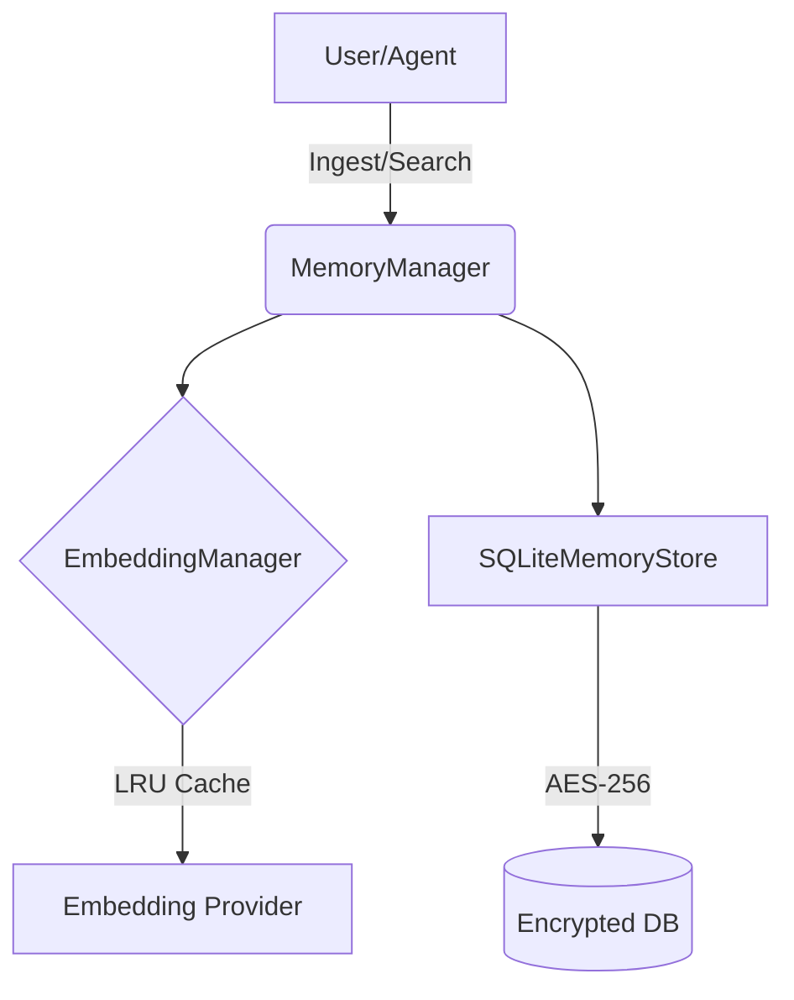
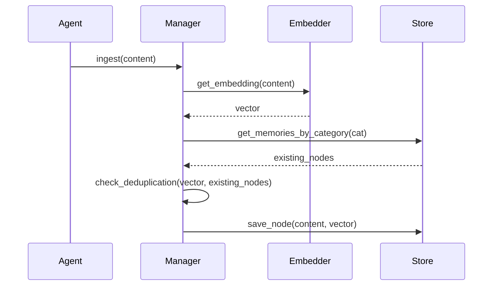

# Synapse Memory

**Synapse Memory** is a sovereign, secure, and performant cognitive memory engine designed to provide AI agents with persistent, long-term, and encrypted memory storage.

[](https://github.com/example/synapse_memory/actions)
[](https://opensource.org/licenses/MIT)

## Overview

Synapse Memory bridges the gap between ephemeral LLM interactions and persistent cognitive context. It provides a structured, secure, and efficient backend for storing and retrieving vectorized memories, utilizing industry-standard encryption and optimized SQL indexing.

## System Architecture

The engine is composed of three primary layers: the **Storage Layer** (SQLite + Encryption), the **Embedding Layer** (Provider abstraction + LRU Caching), and the **Manager Layer** (Deduplication Logic).



### Ingestion Workflow


## Security Model

Security is baked into the storage layer. All sensitive content and embedding vectors are encrypted before persisting to the SQLite database.

*   **Encryption Standard**: Uses `cryptography.fernet` (AES-256).
*   **Encrypted Fields**: `content` and `embedding` (serialized).
*   **Key Management**: The provider requires a 32-byte URL-safe base64-encoded key.

## Performance Optimization

To handle high-throughput memory ingestion, Synapse Memory employs several optimization strategies:

| Technique | Purpose | Benefit |
| :--- | :--- | :--- |
| **LRU Caching** | Embedding results | Reduces expensive API calls to embedding providers. |
| **Category Indexing** | SQLite `category` column | Constrains vector search to relevant cognitive nodes. |
| **Deduplication** | Semantic comparison | Prevents storage bloat and redundant computation. |

## Features

*   **Security-First**: AES-256 encryption at rest (Fernet) ensures sensitive data is never persisted in plain text.
*   **Highly Performant**: Optimized category-based SQL indexing and LRU-cached embedding operations.
*   **Observability**: Integrated instrumentation for monitoring cost, latency, and cache hits.
*   **Extensible**: Modular architecture for embedding providers (Gemini, OpenAI, Local).
*   **Production-Ready**: CI/CD pipeline integrated with linting and type-checking.

## Quick Start

### Installation

```bash
pip install synapse-memory
```

### Basic Usage

```python
from synapse_memory.core.sqlite_db import SQLiteMemoryStore
from synapse_memory.core.embedding_provider import LocalEmbeddingProvider, EmbeddingManager
from synapse_memory.core.memory_manager import MemoryManager

# 1. Initialize with persistence
store = SQLiteMemoryStore(db_path="my_agent.db")
embedder = EmbeddingManager(LocalEmbeddingProvider(dim=128))
manager = MemoryManager(store=store, embedder=embedder)

# 2. Ingest
manager.ingest_with_deduplication("Agent context memory node", category="knowledge")

# 3. Retrieve
all_memories = store.get_all_memories()
```

## Documentation

For full API reference and advanced configuration, see the [generated documentation](docs/).

## Contributing

We welcome contributions. See [CONTRIBUTING.md](CONTRIBUTING.md) for guidelines on development, testing, and submitting pull requests.

## License

This project is licensed under the MIT License.
